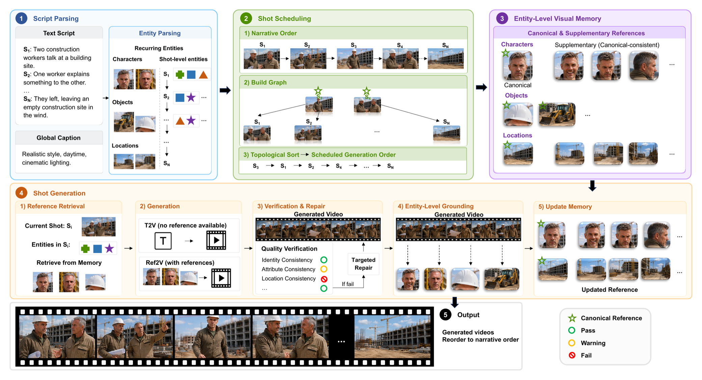
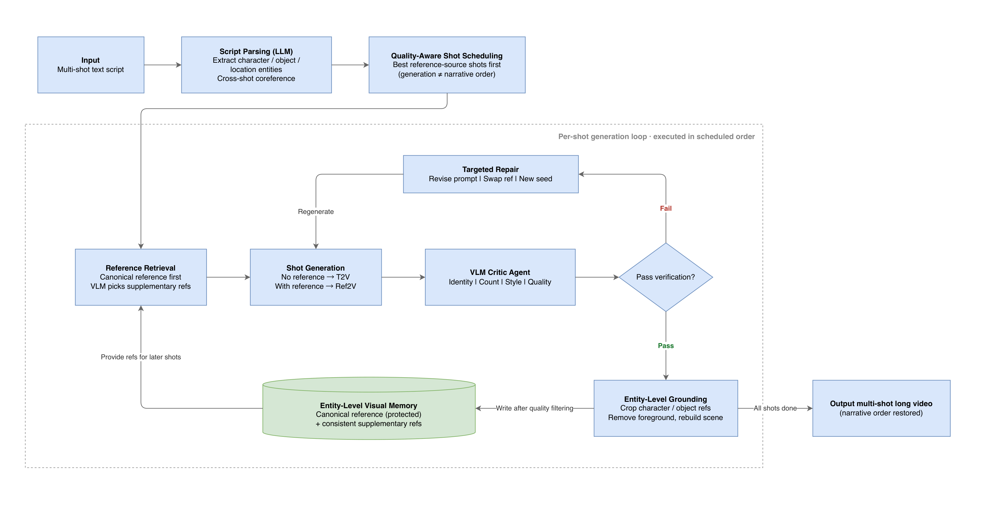

<div align="center">

# GroundShot

### Visually Consistent Multi-Shot Long Video Generation via Entity-Grounded Shot Scheduling

[](https://arxiv.org/abs/2606.20799)
[](https://github.com/YixuannnL/GroundShot)
[](https://www.python.org/)
[](#method-overview)
[](#supported-backends)

**Yixuan Lai · Tianjia Shao · Weijia Dou · Siyu Zhu · Jingdong Wang**

[[Paper](https://arxiv.org/abs/2606.20799)] ·
[[Code](https://github.com/YixuannnL/GroundShot)]

</div>

---

## TL;DR

**GroundShot** is a training-free, model-agnostic framework for generating visually consistent multi-shot videos. Instead of generating shots strictly in narrative order, GroundShot first prioritizes shots that are likely to establish strong visual references. It then grounds recurring characters, objects, and locations, stores reliable observations in an entity-level visual memory, and reuses them to condition later shots.

The paper also introduces **GroundBench**, a diagnostic benchmark for evaluating entity-level consistency across controlled multi-shot challenges.

## Highlights

| | |
|---|---|
| **Quality-aware shot scheduling** | Generates reference-source shots early, rather than treating narrative order as generation order. |
| **Entity-level visual memory** | Maintains protected canonical references and complementary views for recurring characters, objects, and locations. |
| **Grounded memory updates** | Extracts entity-level evidence from generated videos and admits only reliable references into memory. |
| **Adaptive reference retrieval** | Selects references according to the target shot and the conditioning limits of the active video backend. |
| **Verification and targeted repair** | Detects high-risk failures, strengthens constraints, and retries only when needed. |
| **Training-free and model-agnostic** | Works as an orchestration layer around text-to-video and reference-to-video systems without modifying their weights. |

## Method Overview

<p align="center">
  
</p>

<p align="center"><em>Overview of the GroundShot pipeline.</em></p>

### Agentic Pipeline

<p align="center">
  
</p>

<p align="center"><em>The agentic generation loop for scheduling, grounding, verification, and memory updates.</em></p>

GroundShot runs the following loop:

1. Parse the complete script and resolve recurring entities across shots.
2. Predict which shots can provide the strongest references for those entities.
3. Build a dependency graph and schedule generation around reference quality.
4. Retrieve entity-specific references and choose T2V or Ref2V generation.
5. Verify the generated shot, apply targeted repair when necessary, and ground reliable entity observations.
6. Update visual memory and return all clips to their original narrative order.

## News

- **2026-08:** GroundShot core code is available.
- GroundBench, evaluation code, runnable examples, and more visual results will be released soon.

## Installation

```bash
git clone https://github.com/YixuannnL/GroundShot.git
cd GroundShot

conda create -n groundshot python=3.11 -y
conda activate groundshot
pip install -r requirements.txt
```

## Supported Backends

GroundShot currently supports **Vidu** for text-to-video and reference-to-video generation. Its modular backend interface also allows additional video generation models to be integrated.

## Repository Structure

```text
groundshot/
├── config.py          # Central configuration and reproducibility switches
├── schema.py          # Scripts, entities, shots, references, and verdicts
├── parsing/           # Script parsing and cross-shot coreference
├── scheduling/        # Reference-oriented shot scheduling
├── memory/            # Entity-level visual memory
├── grounding/         # Entity grounding and scene reconstruction
├── selection/         # Target-aware reference selection
├── generation/        # Video backend abstraction and adapters
├── verification/      # Critic, targeted repair, and experience memory
├── llm/               # OpenAI / Anthropic reasoning interface
├── utils/             # Media and provider utilities
└── pipeline.py        # End-to-end GroundShot orchestration
```

## GroundBench

GroundBench evaluates consistency at the entity level rather than treating a multi-shot video as a single undifferentiated sequence. It separates controlled challenges involving recurring characters, objects, locations, appearance changes, temporal gaps, occlusion, and long-range reappearance.

GroundBench benchmark data, evaluation code, and usage instructions will be released soon.

## Citation

If you find GroundShot useful in your research, please cite:

```bibtex
@article{lai2026groundshot,
  title   = {GroundShot: Visually Consistent Multi-Shot Long Video Generation via Entity-Grounded Shot Scheduling},
  author  = {Lai, Yixuan and Shao, Tianjia and Dou, Weijia and Zhu, Siyu and Wang, Jingdong},
  journal = {arXiv preprint arXiv:2606.20799},
  year    = {2026}
}
```
